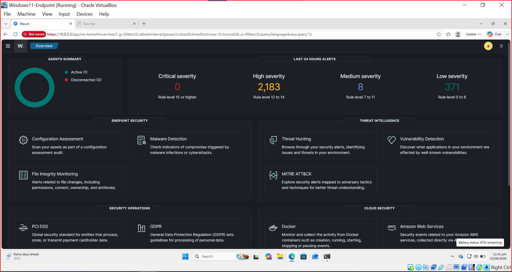
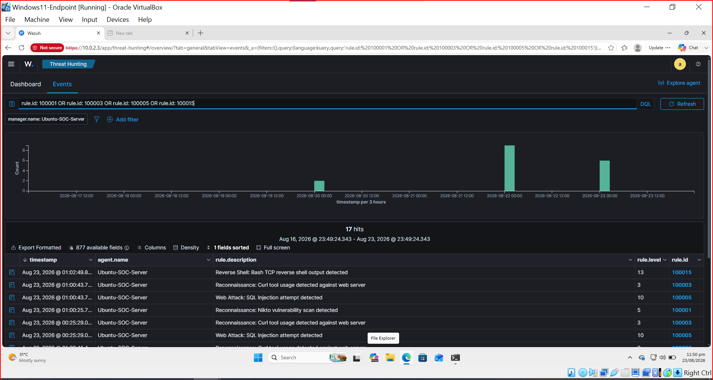
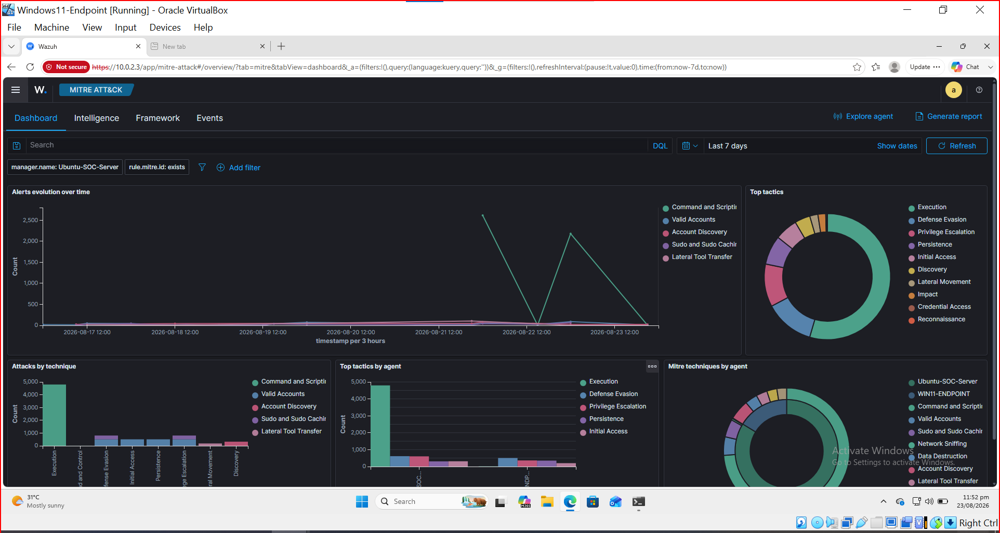
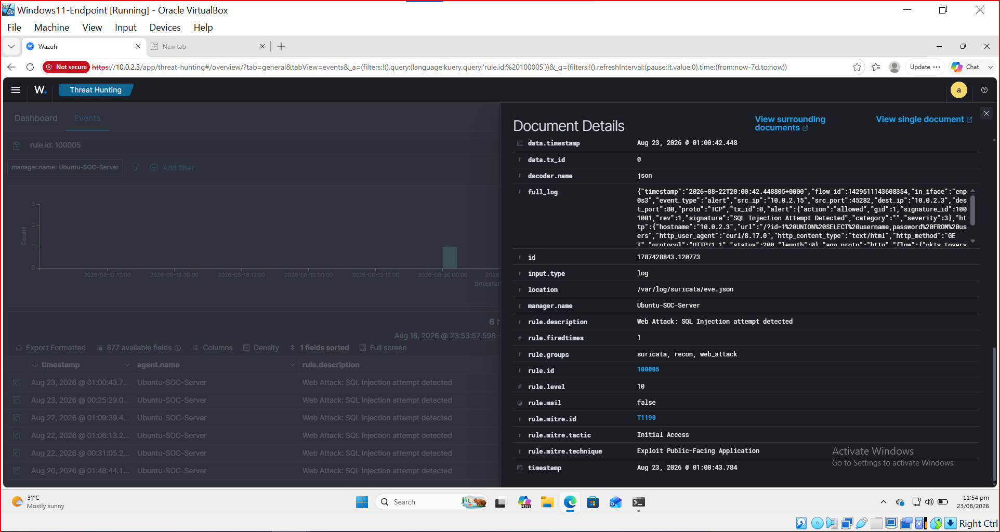
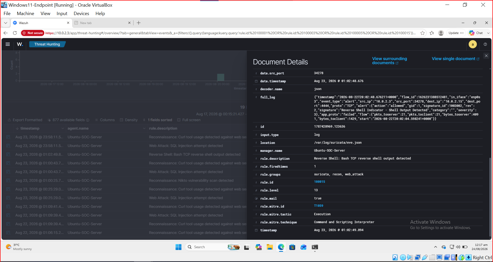
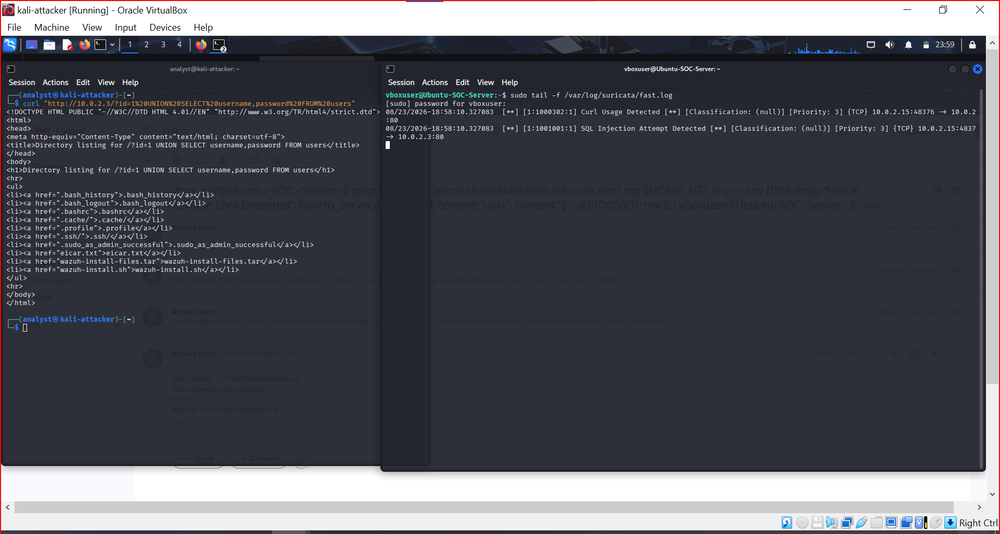
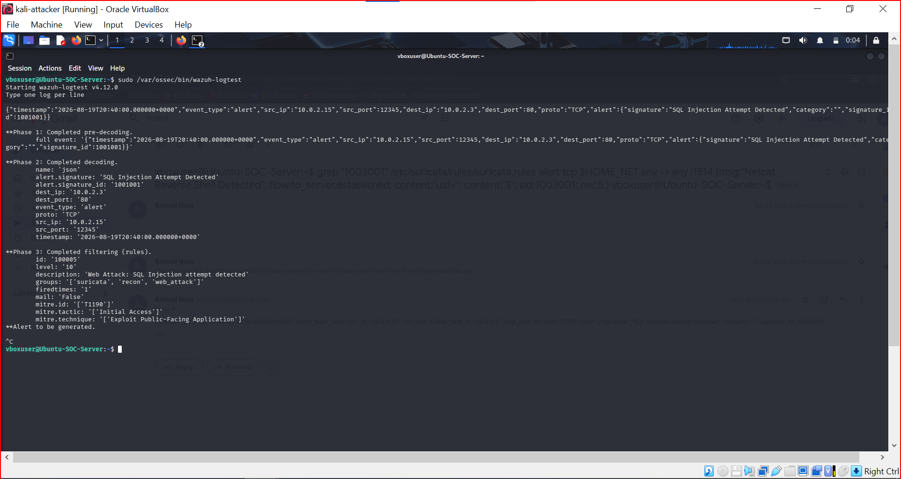
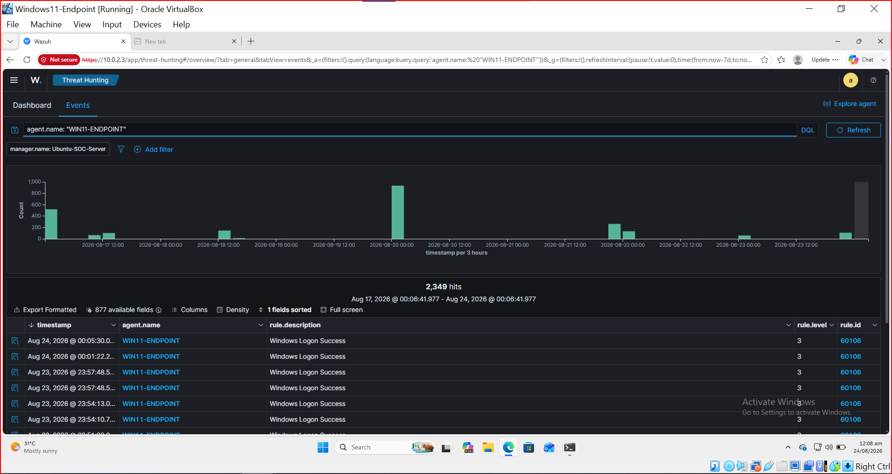

#  Home SOC Blue Team Lab


<p align="center">
  <b>A hands-on, fully virtualized Blue Team / SOC laboratory for attack simulation, network detection, endpoint telemetry, SIEM analysis, and MITRE ATT&CK mapping.</b>
</p>

<p align="center">
  <code>Attack → Detect → Collect → Analyze → Map → Investigate</code>
</p>

---

## About the Project

The **Home SOC Blue Team Lab** is a practical cybersecurity laboratory built to simulate a small Security Operations Center using three virtual machines.

The lab combines **Suricata** for network intrusion detection, **Wazuh** for centralized security monitoring and SIEM capabilities, and **Sysmon + Wazuh Agent** for Windows endpoint telemetry.

The project goes beyond installing security tools. Controlled attack traffic is generated from Kali Linux, Suricata detects the network behavior, Wazuh ingests and classifies the resulting events, custom rules assign severity and MITRE ATT&CK techniques, and the final alerts are investigated through the Wazuh Dashboard.

### Core workflow

```text
Kali Linux
  Attacker
     │
     │ Controlled attack traffic
     ▼
Suricata IDS
     │
     │ eve.json
     ▼
Wazuh Manager
     │
     │ Custom detection rules
     ▼
Wazuh Indexer
     │
     ▼
Wazuh Dashboard
     │
     ▼
SOC Investigation + MITRE ATT&CK
```

Windows endpoint telemetry follows a parallel path:

```text
Windows 11
    │
    ▼
  Sysmon
    │
    ▼
Wazuh Agent
    │
    ▼
Wazuh Manager
    │
    ▼
Wazuh Dashboard
```

---

## Objectives

- Build an isolated virtual SOC environment.
- Configure attacker, endpoint, and SOC-server communication.
- Deploy Wazuh 4.12 as the central SIEM/security-monitoring platform.
- Deploy Suricata as a network IDS.
- Collect Windows endpoint telemetry using Sysmon and Wazuh Agent.
- Develop and test custom Suricata signatures.
- Develop and test custom Wazuh rules.
- Map detections to MITRE ATT&CK.
- Simulate reconnaissance, web attacks, command injection, web-shell activity, reverse shells, DoS patterns, malware-test traffic, and DNS anomalies.
- Validate detections with real controlled traffic and Wazuh Logtest.
- Document false positives, parser behavior, detection gaps, and tuning decisions.

---

## Lab Architecture

```text
                    VirtualBox NAT Network
                       SOC-Lab-Network
                          10.0.2.0/24
                               │
          ┌────────────────────┼────────────────────┐
          │                    │                    │
          ▼                    ▼                    ▼
   Kali-Attacker       Windows11-Endpoint    Ubuntu-SOC-Server
     10.0.2.15              10.0.2.4             10.0.2.3
     Kali Linux             Windows 11           Ubuntu Server
          │                    │                    │
          │                 Sysmon                  │
          │                    │                Suricata
          │               Wazuh Agent           Wazuh Manager
          │                    │                Wazuh Indexer
          └──────── Attack ────┴──────────────► Wazuh Dashboard
```

> The IP addresses above are the values captured during the project. DHCP can assign different addresses in another deployment. Update commands and configuration if your environment differs.

Detailed architecture: [`architecture/architecture.md`](architecture/architecture.md)

---

## Virtual Machines

|          VM            |        Role        |          OS           |  RAM |   CPU   |  Disk |
|------------------------|--------------------|-----------------------|-----:|--------:|------:|
| **Kali-Attacker**      | Attack simulation  | Kali Linux 2025.4     | 2 GB | 2 cores | 40 GB |
| **Windows11-Endpoint** | Monitored endpoint | Windows 11 Pro        | 4 GB | 2 cores | 50 GB |
| **Ubuntu-SOC-Server**  | SOC / SIEM / IDS   | Ubuntu Server 22.04.5 | 6 GB | 2 cores | 40 GB |

---

## Technology Stack

|         Technology     |                     Role                        |
|------------------------|-------------------------------------------------|
| **Oracle VirtualBox**  | Virtualization and isolated lab networking      |
| **Kali Linux**         | Attacker and security-testing platform          |
| **Windows 11**         | Monitored endpoint                              |
| **Ubuntu Server**      | Central SOC server                              |
| **Wazuh 4.12**         | SIEM, security monitoring, rule-based detection |
| **Wazuh Indexer**      | Event storage and search                        |
| **Wazuh Dashboard**    | Visualization, threat hunting, investigation    |
| **Suricata**           | Network IDS                                     |
| **Sysmon**             | Windows endpoint telemetry                      |
| **MITRE ATT&CK**       | Adversary behavior mapping                      |
| **Nmap**               | Reconnaissance                                  |
| **Nikto**              | Web reconnaissance testing                      |
| **Gobuster**           | Directory enumeration                           |
| **Curl / Wget**        | HTTP detection testing                          |
| **Netcat**             | Controlled shell demonstration                  |
| **Python HTTP Server** | Lightweight test target                         |

---

## Detection Coverage

The lab contains **20 custom Suricata signatures** and **20 corresponding Wazuh classification rules**.

|      Category       |  Rules |
|---------------------|-------:|
| Reconnaissance      |    4   |
| SQL Injection / XSS |    3   |
| Command Injection   |    3   |
| Web Shell / Upload  |    3   |
| Reverse Shell       |    2   |
| Denial of Service   |    2   |
| Malware Test        |    1   |
| DNS Anomalies       |    2   |
|      **Total**      | **20** |

Rule details: [`docs/rule-reference.md`](docs/rule-reference.md)

Suricata rules: [`rules/suricata/suricata.rules`](rules/suricata/suricata.rules)

Wazuh rules: [`rules/wazuh/local_rules.xml`](rules/wazuh/local_rules.xml)

---

## MITRE ATT&CK Coverage

The custom Wazuh rules map observed behaviors to techniques including:

| Technique | Description                       | Example Detection                   |
| --------- | --------------------------------- | ----------------------------------- |
| T1595     | Active Scanning                   | Nikto, Gobuster, Curl, Wget         |
| T1190     | Exploit Public-Facing Application | SQL Injection, XSS                  |
| T1059     | Command and Scripting Interpreter | Command Injection, Shell Output     |
| T1505.003 | Web Shell                         | PHP Web Shell / Netcat Upload       |
| T1498     | Network Denial of Service         | HTTP Flood, SYN Flood               |
| T1036     | Masquerading                      | EICAR test mapping used in this lab |
| T1071.004 | DNS                               | Long / high-entropy DNS queries     |


The MITRE mappings are educational and should be reviewed before production use.

---

## Attack Chain

The main demonstration follows this simplified sequence:

```text
┌─────────────────────┐
│ 1. Reconnaissance   │
│       Nmap          │
└──────────┬──────────┘
           ▼
┌─────────────────────┐
│ 2. Web Enumeration  │
│   Nikto / Curl      │
└──────────┬──────────┘
           ▼
┌─────────────────────┐
│ 3. Exploitation Test│
│   SQL Injection     │
└──────────┬──────────┘
           ▼
┌─────────────────────┐
│ 4. Shell Simulation │
│   Reverse Shell     │
└──────────┬──────────┘
           ▼
┌─────────────────────┐
│ 5. Investigation    │
│   Wazuh Dashboard   │
└─────────────────────┘
```

Full walkthrough: [`docs/attack-simulation.md`](docs/attack-simulation.md)

---

## Detection Validation

Every custom signature was tested against controlled traffic rather than being left unverified.

Testing covered:

- Nmap reconnaissance
- Nikto scanning
- Gobuster enumeration
- Curl and Wget activity
- SQL injection patterns
- XSS patterns
- Command injection
- PHP web-shell upload patterns
- Netcat payloads
- Reverse-shell output
- HTTP flood patterns
- SYN flood patterns
- EICAR test-file traffic
- Long DNS queries
- High-entropy DNS queries

Each Wazuh rule from `100001` through `100020` was also validated using:

```bash
sudo /var/ossec/bin/wazuh-logtest
```

Detailed test log: [`docs/detection-testing.md`](docs/detection-testing.md)

---

## Evidence

The repository contains screenshots captured from the working lab.

### Wazuh Dashboard



### Attack Chain



### MITRE ATT&CK



### SQL Injection Detection



### Reverse Shell Detection



### Suricata Detection



### Wazuh Logtest



### Sysmon Telemetry



More evidence: [`screenshots/README.md`](screenshots/README.md)

---

## Detection Pipeline

```text
Kali Attack Traffic
        │
        ▼
┌─────────────────────┐
│      Suricata       │
│      Network IDS    │
└──────────┬──────────┘
           │
           ▼
 /var/log/suricata/eve.json
           │
           ▼
┌─────────────────────┐
│   Wazuh Manager     │
└──────────┬──────────┘
           │
           ▼
┌─────────────────────┐
│ Built-in Rule 86601 │
└──────────┬──────────┘
           │
           ▼
┌─────────────────────┐
│ Custom Wazuh Rules  │
│     100001–100020   │
└──────────┬──────────┘
           │
           ▼
┌─────────────────────┐
│ Wazuh Indexer       │
└──────────┬──────────┘
           │
           ▼
┌─────────────────────┐
│ Wazuh Dashboard     │
└─────────────────────┘
```

---

## Quick Setup

### 1. Create the VMs

Create the three virtual machines listed above and attach them to the same VirtualBox NAT Network.

### 2. Configure the NAT Network

Create:

```text
SOC-Lab-Network
10.0.2.0/24
```

### 3. Install Wazuh

On Ubuntu:

```bash
curl -sO https://packages.wazuh.com/4.12/wazuh-install.sh
sudo bash ./wazuh-install.sh -a
```

### 4. Install the Windows Agent + Sysmon

Deploy the Wazuh Agent from the dashboard, then configure Sysmon telemetry as documented in [`docs/setup-guide.md`](docs/setup-guide.md).

### 5. Install Suricata

```bash
sudo apt update
sudo apt install -y suricata
```

Copy the custom rules:

```bash
sudo cp rules/suricata/suricata.rules /etc/suricata/rules/suricata.rules
```

Validate:

```bash
sudo suricata -T -c /etc/suricata/suricata.yaml
```

### 6. Integrate Suricata with Wazuh

Configure Wazuh to ingest:

```text
/var/log/suricata/eve.json
```

Then install the custom Wazuh rules:

```bash
sudo cp rules/wazuh/local_rules.xml /var/ossec/etc/rules/local_rules.xml
sudo /var/ossec/bin/wazuh-logtest
sudo /var/ossec/bin/wazuh-control restart
```

### 7. Start the Test Target

```bash
chmod +x scripts/test-webserver.sh
./scripts/test-webserver.sh
```

### 8. Run the Attack Simulation

Follow [`docs/attack-simulation.md`](docs/attack-simulation.md), then verify the resulting alerts in the Wazuh Dashboard.

For the full build process, use [`docs/setup-guide.md`](docs/setup-guide.md).

---

## Repository Structure

```text

architecture/  → SOC architecture and network design
docs/          → Setup, attack simulation, testing, limitations, and lessons learned
rules/         → Suricata and Wazuh detection rules
scripts/       → Lab helper scripts
screenshots/   → Project evidence and detection screenshots

```

---

## Important Lessons Learned

The project exposed several practical detection-engineering issues:

### Suricata HTTP decoding

HTTP URI buffers can be URL-decoded before rule matching. A rule looking for `%3B` can therefore fail when the inspected buffer contains `;`.

### Special characters

Suricata syntax gives special meaning to characters such as `;` and `|`. Correct escaping or hexadecimal representation is required.

### Reverse shells

A string such as `/dev/tcp/` may exist only inside the local Bash process. Detection should focus on artifacts that actually cross the network.

### Alert flooding

High-volume scanners such as Gobuster can generate hundreds of matching requests. Thresholding is necessary to keep the alert stream useful.

### Wazuh field matching

Because the built-in Suricata rule uses `no_full_log`, custom child rules should target decoded fields such as `alert.signature` rather than relying on the full raw JSON event.

### Configuration validation

A malformed Wazuh XML rule can stop the analysis engine. Configuration changes should always be followed by validation and service-status checks.

More details: [`docs/lessons-learned.md`](docs/lessons-learned.md)

---

## Known Limitations

This is an educational detection lab, not a production SOC.

Important limitations include:

- Wazuh Active Response is intentionally disabled.
- Some Suricata DNS/statistics event types were disabled for Wazuh ingestion because of decoder field-count issues.
- Nikto detection relies on a User-Agent and can be evaded.
- Several signatures are intentionally simple and can produce false positives or false negatives.
- Lab IP addresses are environment-specific.
- MITRE mappings should be reviewed before production deployment.

Full details: [`docs/known-limitations.md`](docs/known-limitations.md)

---

## Future Improvements

- Reliable Wazuh Active Response with normalized source-IP extraction.
- Behavioral rather than User-Agent-only scanner detection.
- Additional Windows endpoint detections.
- PowerShell and credential-access detections.
- Persistence and privilege-escalation detections.
- Threat-intelligence enrichment.
- Wireshark/PCAP investigation workflow.
- Automated attack-replay scripts.
- MITRE ATT&CK tactic dashboards.
- Alert correlation and incident-case management.
- More advanced DNS and command-and-control detection.

---

## Ethical Use

This repository is intended for authorized cybersecurity education, Blue Team training, detection engineering, and controlled laboratory experimentation.

**Only test systems you own or are explicitly authorized to assess.** Never run the attack simulations against public or third-party infrastructure.

See [`SECURITY.md`](SECURITY.md) for the repository security policy.

---

## Documentation Map

| Document | Purpose |
|---|---|
| [`architecture/architecture.md`](architecture/architecture.md) | Network and detection architecture |
| [`docs/setup-guide.md`](docs/setup-guide.md) | Full environment setup |
| [`docs/attack-simulation.md`](docs/attack-simulation.md) | End-to-end attack simulation |
| [`docs/detection-testing.md`](docs/detection-testing.md) | Rule-by-rule testing |
| [`docs/rule-reference.md`](docs/rule-reference.md) | Detection and MITRE mapping reference |
| [`docs/lessons-learned.md`](docs/lessons-learned.md) | Troubleshooting and engineering lessons |
| [`docs/known-limitations.md`](docs/known-limitations.md) | Detection and architecture limitations |
| [`screenshots/README.md`](screenshots/README.md) | Evidence index |

---

## 👨‍💻 Author

**Ahmad Noor**

Areas of interest:

- Blue Team Operations
- SOC Analysis
- SIEM
- Detection Engineering
- Network Security
- Threat Detection
- MITRE ATT&CK
- Security Automation

---

## License

This project is licensed under the **MIT License**.

See [`LICENSE`](LICENSE).
