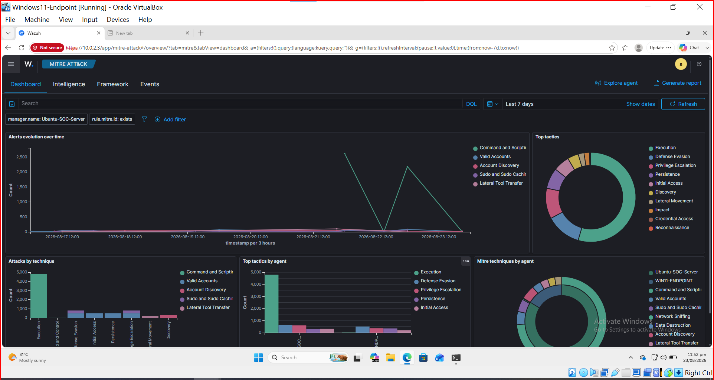
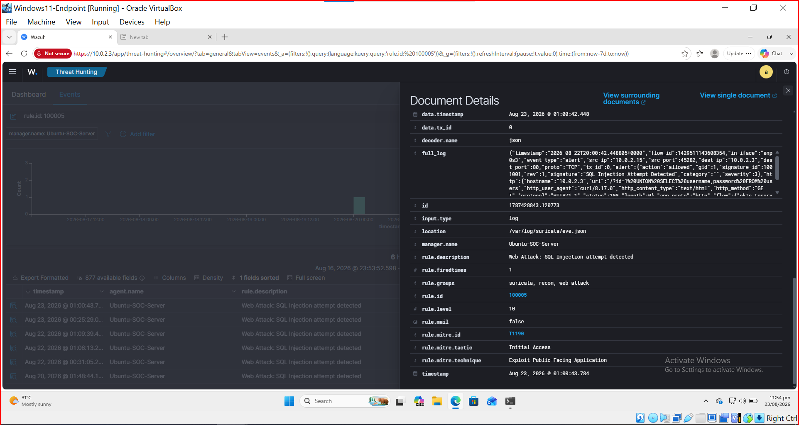
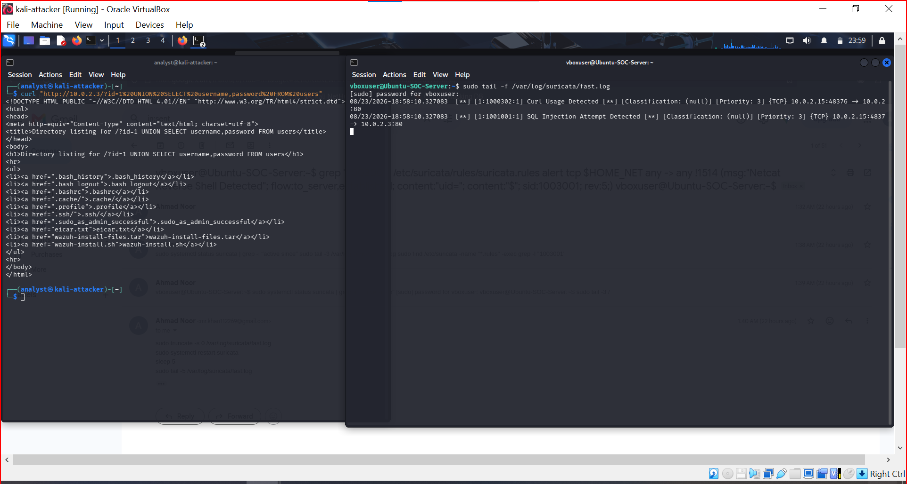
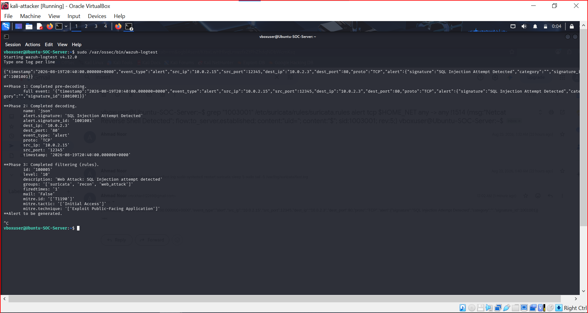

#  Home SOC Blue Team Lab


<p align="center">
  <b>A hands-on, fully virtualized Blue Team / SOC laboratory for attack simulation, network detection, endpoint telemetry, SIEM analysis, and MITRE ATT&CK mapping.</b>
</p>

<p align="center">
  <code>Attack → Detect → Collect → Analyze → Map → Investigate</code>
</p>

---

## About the Project

The **Home SOC Blue Team Lab** is a practical cybersecurity laboratory built to simulate a small Security Operations Center using three virtual machines.

The lab combines **Suricata** for network intrusion detection, **Wazuh** for centralized security monitoring and SIEM capabilities, and **Sysmon + Wazuh Agent** for Windows endpoint telemetry.

The project goes beyond installing security tools. Controlled attack traffic is generated from Kali Linux, Suricata detects the network behavior, Wazuh ingests and classifies the resulting events, custom rules assign severity and MITRE ATT&CK techniques, and the final alerts are investigated through the Wazuh Dashboard.

## Objectives

- Build an isolated virtual SOC environment.
- Configure attacker, endpoint, and SOC-server communication.
- Deploy Wazuh 4.12 as the central SIEM/security-monitoring platform.
- Deploy Suricata as a network IDS.
- Collect Windows endpoint telemetry using Sysmon and Wazuh Agent.
- Develop and test custom Suricata signatures.
- Develop and test custom Wazuh rules.
- Map detections to MITRE ATT&CK.
- Simulate reconnaissance, web attacks, command injection, web-shell activity, reverse shells, DoS patterns, malware-test traffic, and DNS anomalies.
- Validate detections with real controlled traffic and Wazuh Logtest.
- Document false positives, parser behavior, detection gaps, and tuning decisions.

---

## Lab Architecture

Detailed architecture: [`architecture/architecture.md`](architecture/architecture.md)

---

## Detection Coverage

The lab contains **20 custom Suricata signatures** and **20 corresponding Wazuh classification rules**.

Rule details: [`docs/rule-reference.md`](docs/rule-reference.md)

Suricata rules: [`rules/suricata/suricata.rules`](rules/suricata/suricata.rules)

Wazuh rules: [`rules/wazuh/local_rules.xml`](rules/wazuh/local_rules.xml)

## Attack Chain

Full walkthrough: [`docs/attack-simulation.md`](docs/attack-simulation.md)

---

## Detection Validation

Detailed test log: [`docs/detection-testing.md`](docs/detection-testing.md)


## Evidence

The repository contains screenshots captured from the working lab.

### Wazuh Dashboard


### Attack Chain


### MITRE ATT&CK



### SQL Injection Detection



### Reverse Shell Detection


### Suricata Detection



### Wazuh Logtest



### Sysmon Telemetry


More evidence: [`screenshots/README.md`](screenshots/README.md)

---

## Quick Setup

For Quick setup process, use [`docs/setup-guide.md`](docs/setup-guide.md).

---

## Repository Structure

```text

architecture/  → SOC architecture and network design
docs/          → Setup, attack simulation, testing, limitations, and lessons learned
rules/         → Suricata and Wazuh detection rules
scripts/       → Lab helper scripts
screenshots/   → Project evidence and detection screenshots

```

## Ethical Use

This repository is intended for authorized cybersecurity education, Blue Team training, detection engineering, and controlled laboratory experimentation.

**Only test systems you own or are explicitly authorized to assess.** Never run the attack simulations against public or third-party infrastructure.

See [`SECURITY.md`](SECURITY.md) for the repository security policy.

---

## Documentation Map

| Document | Purpose |
|---|---|
| [`architecture/architecture.md`](architecture/architecture.md) | Network and detection architecture |
| [`docs/setup-guide.md`](docs/setup-guide.md) | Full environment setup |
| [`docs/attack-simulation.md`](docs/attack-simulation.md) | End-to-end attack simulation |
| [`docs/detection-testing.md`](docs/detection-testing.md) | Rule-by-rule testing |
| [`docs/rule-reference.md`](docs/rule-reference.md) | Detection and MITRE mapping reference |
| [`docs/lessons-learned.md`](docs/lessons-learned.md) | Troubleshooting and engineering lessons |
| [`docs/known-limitations.md`](docs/known-limitations.md) | Detection and architecture limitations |
| [`screenshots/README.md`](screenshots/README.md) | Evidence index |

---

## 👨‍💻 Author

**Ahmad Noor**

Areas of interest:

- Blue Team Operations
- SOC Analysis
- Network Security
- Security Automation

---

## License

See [`LICENSE`](LICENSE).
